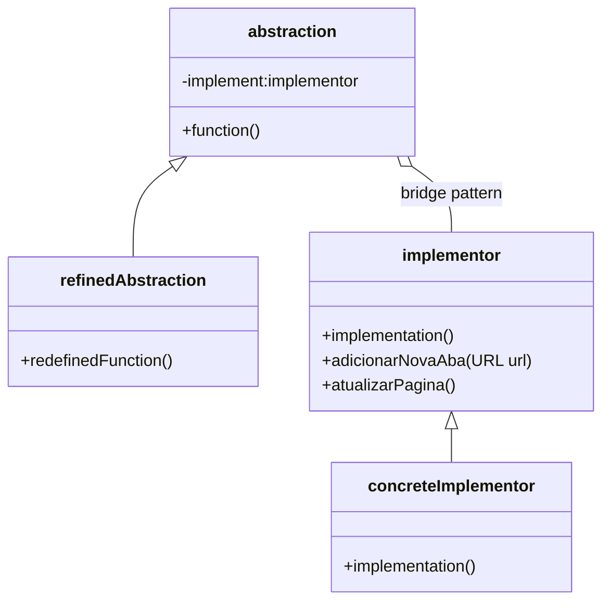
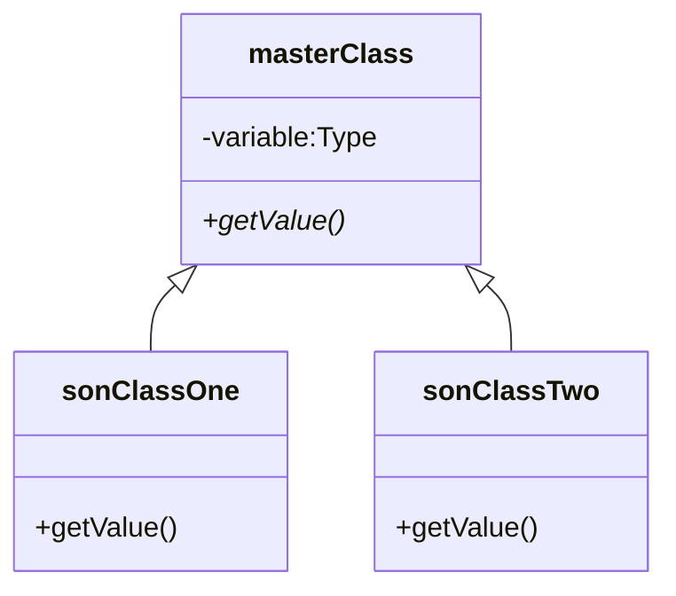

## Bridge Pattern

```mermaid
classDiagram
    class abstraction {
        -implement:implementor
        +function()
    }

    class refinedAbstraction {
        +redefinedFunction()
    }

    class implementor {
        +implementation()
        +adicionarNovaAba(URL url)
        +atualizarPagina()
    }

    class concreteImplementor {
        +implementation()
    }

    abstraction o-- implementor : bridge pattern
    abstraction <|-- refinedAbstraction
    implementor <|-- concreteImplementor
```
##Decorator

```mermaid
classDiagram
    class masterClass {
        -variable:Type
        +getValue()*
    }

    class sonClassOne {
        +getValue()
    }
    class sonClassTwo {
        +getValue()
    }

    masterClass <|-- sonClassOne
    masterClass <|-- sonClassTwo
```
