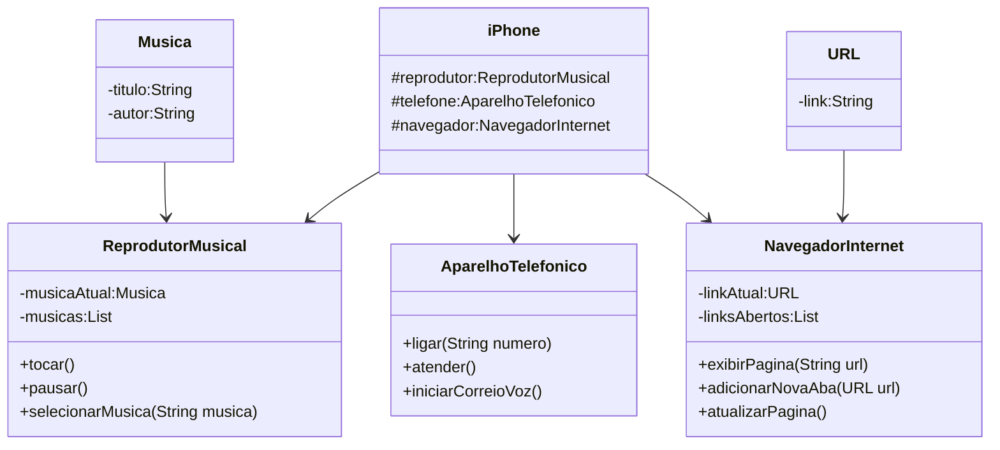

## Bridge Pattern
```mermaid
classDiagramBridgPattern
    class Abstraction {
        -implement:Implementor
        +function:()
    }

    class RefinedAbstraction {
        +redefinedFunction()
    }

    class Implementor {
        +implementation()
        +adicionarNovaAba(URL url)
        +atualizarPagina()
    }

    class ConcreteImplementor {
        +implementation()
    }

    Abstraction o-- Implementor
    Abstraction <|-- RefinedAbstraction
    Implementor <|-- ConcreteImplementor
```
##

