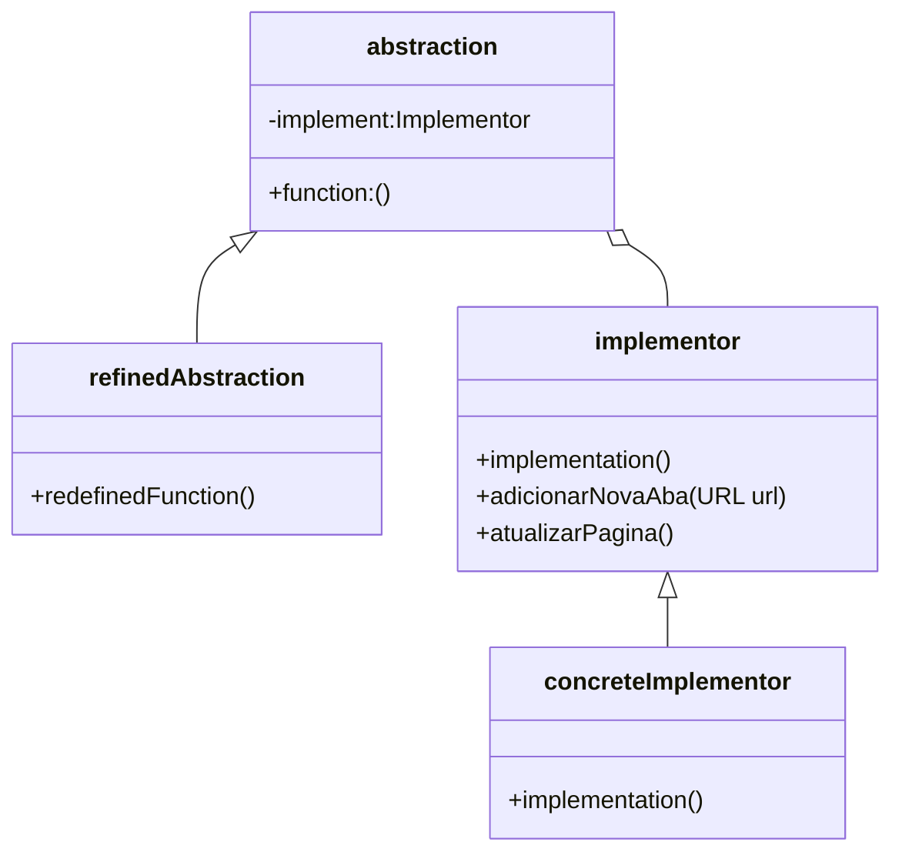
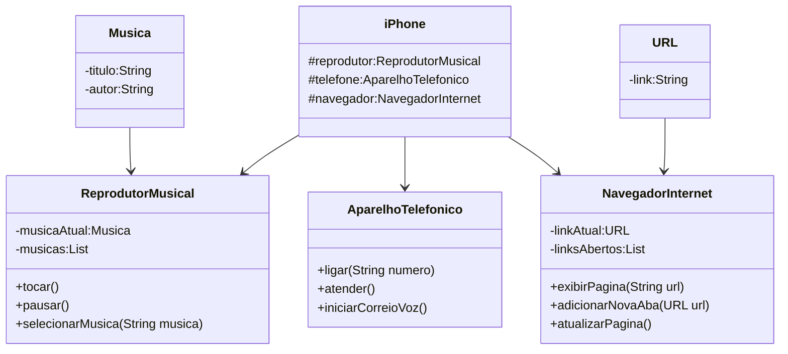

## Bridge Pattern

```mermaid
classDiagram
    class abstraction {
        -implement:Implementor
        +function:()
    }

    class refinedAbstraction {
        +redefinedFunction()
    }

    class implementor {
        +implementation()
        +adicionarNovaAba(URL url)
        +atualizarPagina()
    }

    class concreteImplementor {
        +implementation()
    }

    abstraction o-- implementor
    abstraction <|-- refinedAbstraction
    implementor <|-- concreteImplementor
```
##

```mermaid
classDiagram
    class ReprodutorMusical {
        -musicaAtual:Musica
        -musicas:List<Musica>
        +tocar()
        +pausar()
        +selecionarMusica(String musica)
    }

    class AparelhoTelefonico {
        +ligar(String numero)
        +atender()
        +iniciarCorreioVoz()
    }

    class NavegadorInternet {
        -linkAtual:URL
        -linksAbertos:List<URL>
        +exibirPagina(String url)
        +adicionarNovaAba(URL url)
        +atualizarPagina()
    }

    class iPhone {
        #reprodutor:ReprodutorMusical
        #telefone:AparelhoTelefonico
        #navegador:NavegadorInternet
    }

    class Musica {
        -titulo:String
        -autor:String
    }

    class URL {
        -link:String
    }

    iPhone --> ReprodutorMusical
    iPhone --> AparelhoTelefonico
    iPhone --> NavegadorInternet
    Musica --> ReprodutorMusical
    URL --> NavegadorInternet
```
