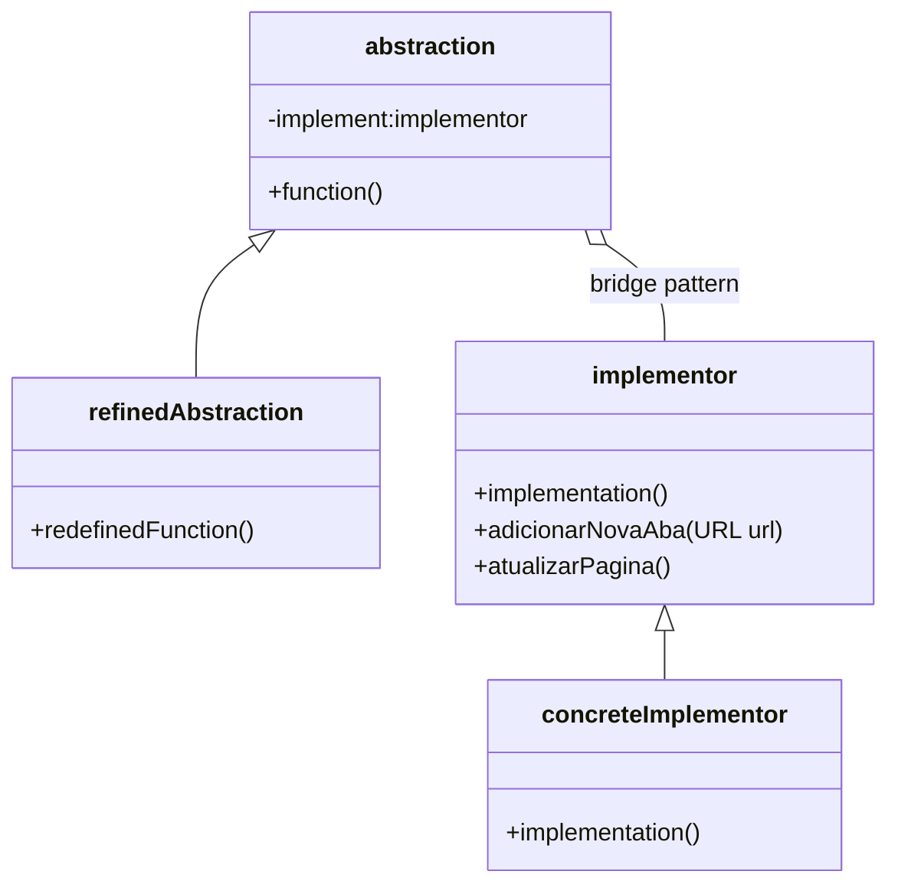
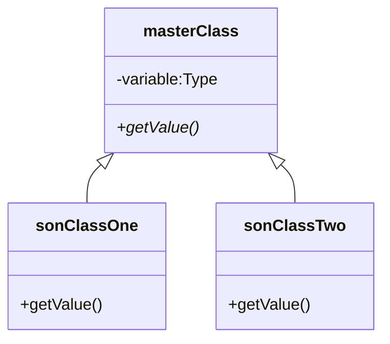
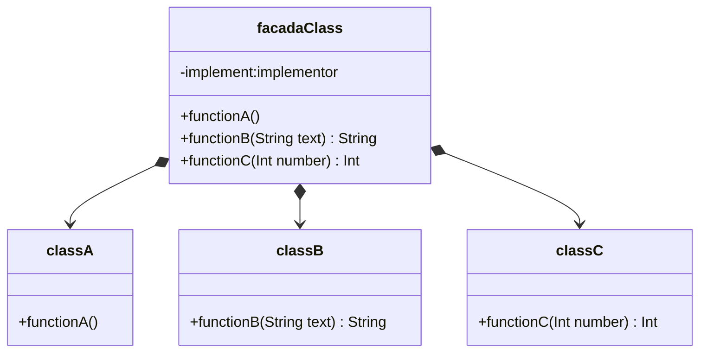

# Pattern Design Projects(UML)
Os padrões de projeto estruturais ajudam a organizar melhor o código, facilitando a manutenção, reutilização e flexibilidade. Abaixo estão sete padrões bastante usados:
## Bridge Pattern
**Problema que resolve:** Evita o crescimento exagerado de subclasses quando há várias variações de uma classe.

**Como funciona:** Separa a abstração da implementação, permitindo que as duas evoluam independentemente.

### Exemplo simples:
Imagine um controle remoto (abstração) que funciona com diferentes tipos de TVs (implementações). O controle não precisa mudar se a TV mudar, e vice-versa.

## Decorator Pattern
**Problema que resolve:** Adicionar funcionalidades extras a um objeto de forma flexível, sem alterar sua estrutura original.

**Como funciona:** "Embrulha" o objeto com outros objetos decoradores que adicionam novos comportamentos.

### Exemplo simples:
Um café simples que pode receber extras como leite, chantilly ou chocolate. Cada extra é um decorador que adiciona algo sem mudar o café base.

## Facada Pattern
**Problema que resolve:** Complexidade de múltiplas classes ou sistemas.

**Como funciona:** Cria uma interface simples que esconde a complexidade de um sistema mais complexo.

### Exemplo simples:
Um controle remoto universal que oferece botões simples, mas por trás interage com vários aparelhos diferentes (TV, som, ar-condicionado).

## Adapter Pattern
**Problema que resolve:** Incompatibilidade entre interfaces.

**Como funciona:** Conecta classes com interfaces diferentes para que elas possam trabalhar juntas.

### Exemplo simples:
Um carregador de celular que adapta a tomada americana para o padrão brasileiro. O carregador (adapter) permite que seu celular funcione mesmo com uma tomada diferente.

## Composite Pattern
**Problema que resolve:** Tratar objetos individuais e grupos de objetos da mesma maneira.

**Como funciona:** Organiza objetos em uma estrutura de árvore, onde cada nó pode ser um objeto simples ou um grupo de objetos.

### Exemplo simples:
Um menu em um aplicativo que pode conter opções simples ou submenus. Você pode ativar qualquer item do menu da mesma forma, sem se importar se é uma opção única ou um grupo.

## Flyweight Pattern
**Problema que resolve:** Muitos objetos semelhantes consumindo muita memória.

**Como funciona:** Compartilha dados comuns entre vários objetos semelhantes, criando apenas o que for necessário.

### Exemplo simples:
Em um editor de texto, em vez de criar um objeto para cada letra, ele reutiliza o mesmo objeto para todas as letras "a", "b", etc., economizando memória.

## Proxy Pattern
**Problema que resolve:** Controle de acesso, carregamento atrasado ou funcionalidades extras para um objeto real.

**Como funciona:** Um objeto "proxy" age como substituto do objeto real, controlando o acesso a ele.

### Exemplo simples:
Um porteiro (proxy) que decide quem pode entrar em um prédio (objeto real). Ele pode bloquear, registrar ou atrasar o acesso.

